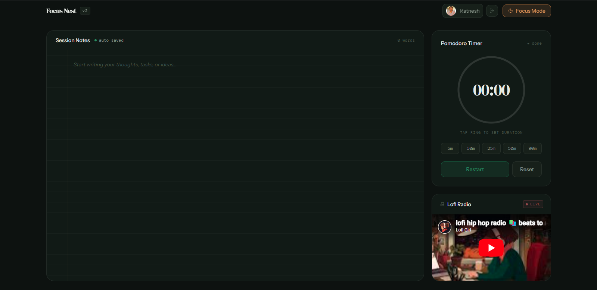
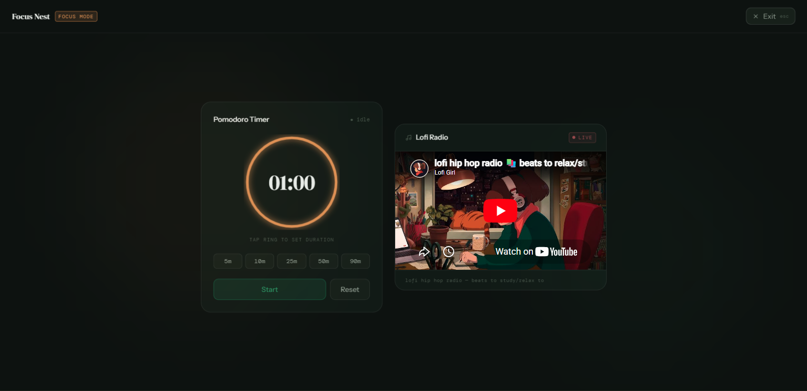
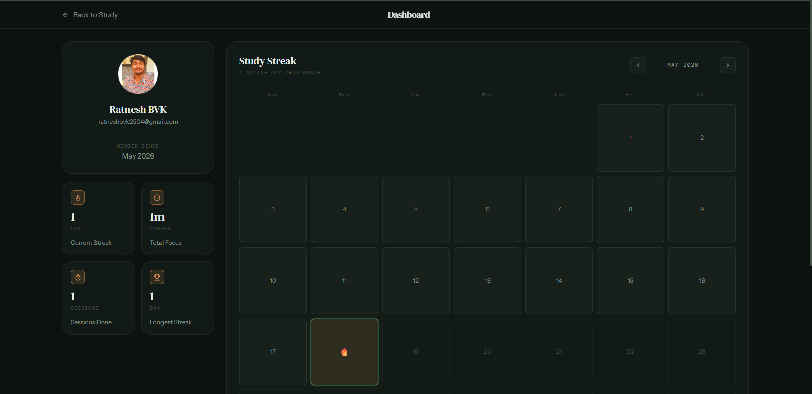
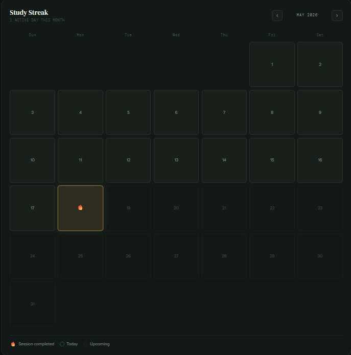

# Focus Nest 🌙

> A modern, minimalist **Study With Me** web app — Pomodoro timer, session notes, lofi music, Google authentication, and a personal study dashboard with streak tracking.

Focus Nest v2 is a full-stack productivity platform built for students and developers who want to stay focused, track their progress over time, and build consistent study habits.

<div align="center">

[](LICENSE)
[](https://react.dev)
[](https://www.typescriptlang.org)
[](https://tailwindcss.com)
[](https://vitejs.dev)

</div>

---

## 📸 Screenshots

### 🏠 Home Page

The main study workspace featuring the Pomodoro timer, session notes, and ambient music player.



---

### 🎯 Focus Mode

A distraction-free fullscreen environment with the timer and lofi music side by side.



---

### 📊 Dashboard

Your personal analytics dashboard showing profile details, total focus time, completed sessions, and streak statistics.



---

### 🔥 Streak Calendar

A GitHub-style monthly heatmap calendar highlighting every day you studied.



---

## ✨ Features

### ⏱️ Pomodoro Timer

- Preset durations: 5, 10, 25, 50, 90 minutes
- Custom duration via a smooth scroll-snap picker (1–180 minutes)
- Animated circular progress ring
- Start, Pause, Reset controls
- Timer state persists across page refreshes (Zustand + localStorage)
- Completion alarm sound, browser notification, and in-app toast

### 📝 Session Notes

- Full-height distraction-free writing area with a ruled-paper aesthetic
- Live word count
- Auto-saved to localStorage — never lose your thoughts

### 🎧 Ambient Music

- Embedded lofi hip hop YouTube live stream
- Available in both normal and Focus Mode

### 🌙 Focus Mode

- Fullscreen distraction-free overlay
- Timer and music player side by side
- Ambient gradient background orbs
- Exit with the button or `Esc` key
- Focus Mode state persists across refreshes

### 🔐 Authentication (v2)

- Google OAuth via Supabase
- Session persisted automatically across tabs and refreshes
- Signed-in users get access to cloud sync and the personal dashboard

### 📊 Dashboard (v2)

- Profile card with Google avatar, name, and join date
- Stats grid: current streak, total focus time, sessions completed, longest streak
- Monthly streak calendar with activity heatmap
- Live updates after every completed session

### 🔥 Study Streak System (v2)

- Every completed Pomodoro session is recorded to Supabase
- Daily activity tracked automatically — no manual logging
- Streaks calculated server-side via PostgreSQL RPC functions
- Monthly calendar highlights days you studied with 🔥

### 💾 Persistence

- Timer settings and remaining time: Zustand persist → localStorage
- Session notes: localStorage
- Study history, streaks, and stats: Supabase (cloud)

### 📱 Responsive Design

- Works across desktop and mobile
- Adaptive layouts for Focus Mode and Dashboard

---

## 🛠️ Tech Stack

| Category          | Technology                         |
| ----------------- | ---------------------------------- |
| Frontend          | React 19 + TypeScript ~6           |
| Styling           | Tailwind CSS v4                    |
| Build Tool        | Vite 8                             |
| Package Manager   | Bun                                |
| State Management  | Zustand 5                          |
| Routing           | React Router DOM v7                |
| Backend / Auth    | Supabase (PostgreSQL + Auth + RPC) |
| Notifications     | react-hot-toast                    |
| Icons             | Lucide React                       |
| Local Persistence | Browser localStorage               |
| Cloud Persistence | Supabase PostgreSQL                |

---

## 📂 Project Structure

```
src/
├── components/
│   ├── layout/
│   │   ├── Header.tsx          # Nav, auth controls, Focus Mode toggle
│   │   └── FocusMode.tsx       # Fullscreen overlay
│   ├── timer/
│   │   ├── TimerCard.tsx       # Ring UI + preset buttons
│   │   └── TimerSettingsModal.tsx  # Scroll-snap custom picker
│   ├── music/
│   │   └── MusicCard.tsx       # YouTube lofi embed
│   └── notes/
│       └── SessionNotes.tsx    # Auto-saving textarea
│
├── features/
│   ├── auth/
│   │   ├── auth.ts             # Supabase OAuth helpers
│   │   └── AuthGate.tsx        # Route protection
│   ├── dashboard/
│   │   ├── StreakCalendar.tsx  # Monthly heatmap calendar
│   │   ├── dashboardApi.ts     # Supabase queries (profile, stats, dates)
│   │   └── calendarUtils.ts    # Date helpers
│   └── stats/
│       └── statsApi.ts         # record_study_session RPC call
│
├── pages/
│   ├── HomePage.tsx            # / — study workspace
│   └── DashboardPage.tsx       # /dashboard — stats + calendar
│
├── store/
│   ├── useTimerStore.ts        # Timer state (persisted)
│   ├── useAuthStore.ts         # Supabase session
│   ├── useDashboardStore.ts    # Profile + stats + streak days
│   └── useStatsStore.ts        # Session recording
│
├── hooks/
│   └── useLocalStorage.ts      # Generic localStorage hook
│
├── lib/
│   ├── supabase.ts             # Supabase client init
│   ├── formatTime.ts           # MM:SS formatter
│   └── notifySessionComplete.ts # Toast + browser notification + alarm
│
├── App.tsx                     # Router + store initialization
├── main.tsx                    # React root
└── index.css                   # Tailwind + custom design tokens

public/
├── alarm.mp3                   # Completion sound
├── focus.png                   # Focus Mode screenshot
└── home.png                    # Home page screenshot
```

---

## 🗄️ Database Schema

Focus Nest uses three Supabase tables and one RPC function. See [docs/database-schema.md](docs/database-schema.md) for the full schema, column definitions, and Row Level Security policies.

**Tables:** `profiles` · `study_sessions` · `daily_activity` · `user_stats`

**RPC:** `record_study_session(p_user_id, p_duration_minutes)` — atomically inserts the session, upserts daily activity, and updates streak counters.

---

## 🚀 Getting Started

### Prerequisites

- [Bun](https://bun.sh) installed
- A [Supabase](https://supabase.com) project (free tier works fine)

### 1. Clone the repository

```bash
git clone https://github.com/ratnesh2507/Focus-Nest.git
cd Focus-Nest
```

### 2. Install dependencies

```bash
bun install
```

### 3. Set up environment variables

Create a `.env.local` file in the project root:

```env
VITE_SUPABASE_URL=https://your-project-id.supabase.co
VITE_SUPABASE_ANON_KEY=your-anon-key-here
```

Both values are available in your Supabase project under **Settings → API**.

### 4. Set up the database

Run the SQL from [docs/database-schema.md](docs/database-schema.md) in your Supabase SQL editor to create all tables, RPC functions, and RLS policies.

### 5. Configure Google OAuth

In your Supabase dashboard go to **Authentication → Providers → Google**, enable it, and paste in your Google Cloud OAuth credentials. Add `http://localhost:5173` to the allowed redirect URLs for local development.

### 6. Start the dev server

```bash
bun run dev
```

Open [http://localhost:5173](http://localhost:5173).

---

## 🏗️ Architecture

Focus Nest follows a clean layered architecture:

```
UI Components  (React + Tailwind)
      ↓
Zustand Stores (global state)
      ↓
Feature APIs   (Supabase queries + RPCs)
      ↓
Supabase Client
      ↓
PostgreSQL Database
```

See [docs/architecture.md](docs/architecture.md) for a full component tree, data-flow diagrams, and design decisions.

---

## 🔥 How Streaks Work

When a Pomodoro timer completes:

1. `notifySessionComplete()` fires (toast + browser notification + alarm)
2. `useTimerStore` checks if a user is signed in
3. `useStatsStore.recordCompletedSession()` calls the Supabase RPC `record_study_session`
4. The RPC atomically inserts into `study_sessions`, upserts `daily_activity`, and recalculates `user_stats`
5. `useDashboardStore.refreshStats()` re-fetches updated numbers so the dashboard reflects the new session immediately

See [docs/streak-system.md](docs/streak-system.md) for the complete flow.

---

## 🔐 Authentication Flow

```
User clicks "Sign In"
      ↓
Google OAuth via Supabase
      ↓
Redirected back to /dashboard
      ↓
Session stored in Supabase Auth
      ↓
useAuthStore reacts to onAuthStateChange
      ↓
Dashboard and cloud features unlocked
```

See [docs/authentication-flow.md](docs/authentication-flow.md) for the full OAuth sequence and session management details.

---

## 🌐 Deployment

Focus Nest is designed to deploy on Vercel with zero configuration. See [docs/deployment.md](docs/deployment.md) for the step-by-step guide covering Supabase setup, environment variables, Vercel deployment, and OAuth redirect URL configuration.

---

## 🗺️ Roadmap

### v2.0 — Current

- [x] Google OAuth authentication
- [x] Cloud session recording
- [x] Personal dashboard
- [x] Current and longest streaks
- [x] Monthly study heatmap calendar
- [x] Total focus time tracking

### v2.1 — Next

- [ ] Session history list with timestamps
- [ ] Focus time charts (daily/weekly/monthly)
- [ ] Export data as CSV

### v3.0 — Future

- [ ] Task and goal management
- [ ] Custom themes
- [ ] AI-powered study insights
- [ ] Premium subscription tier

See [docs/roadmap.md](docs/roadmap.md) for detailed plans.

---

## 📦 Key Dependencies

```bash
bun add zustand react-hot-toast lucide-react react-router-dom @supabase/supabase-js
```

---

## 🧠 What This Project Demonstrates

Focus Nest is a complete full-stack SaaS application showcasing:

- **React + TypeScript** — component architecture, custom hooks, typed props
- **Tailwind CSS v4** — custom design tokens, responsive layouts, glassmorphism
- **Zustand** — global state, persist middleware, cross-store calls
- **React Router v7** — client-side routing, protected routes
- **Supabase** — PostgreSQL, Auth, RPC functions, Row Level Security
- **OAuth** — Google sign-in with redirect flow and session management
- **Data visualization** — streak calendar heatmap, animated SVG timer ring
- **SaaS architecture** — free tier (local) and account tier (cloud) feature split
- **Browser APIs** — Notification API, Web Audio API, localStorage

---

## 📄 License

MIT License — open source and free to use.

---

## 👨‍💻 Author

**Ratnesh BVK** — Full-Stack Web Developer

- [GitHub](https://github.com/ratnesh2507)

---

> Focus Nest is a simple yet powerful productivity companion built to help you stay focused, consistent, and motivated. ☕
